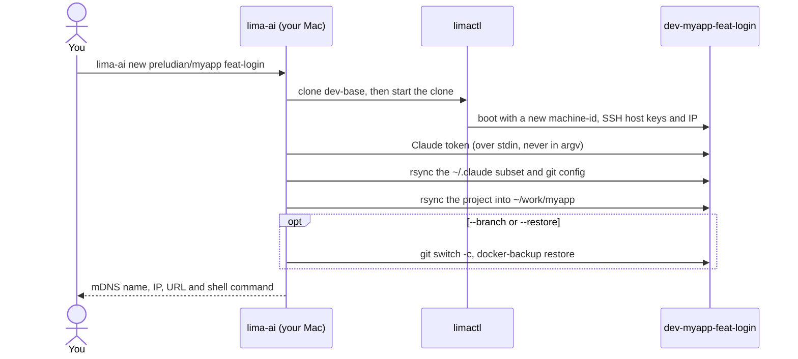
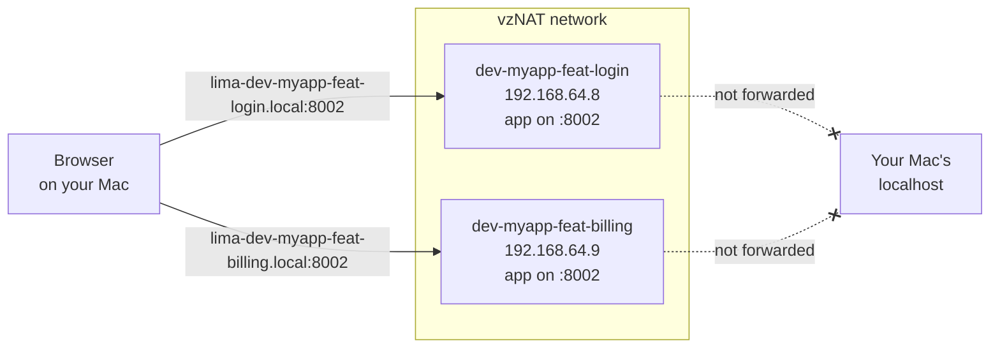
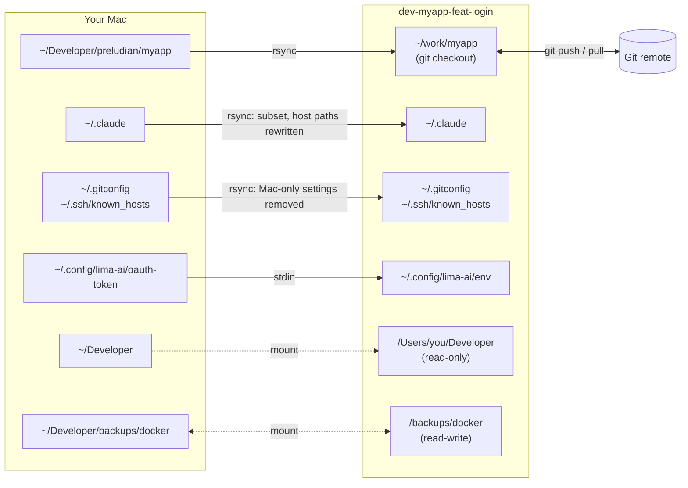

# lima-ai

Run several Claude Code agents in parallel on a Mac, each in its own
disposable Linux VM, each working on one feature of your project.

```
lima-ai new preludian/myapp feat-login     →  http://lima-dev-myapp-feat-login.local:8002
lima-ai new preludian/myapp feat-billing   →  http://lima-dev-myapp-feat-billing.local:8002
```

Every VM gets its own copy of the project, its own Docker daemon and its own
network address. The same `docker compose` app can run on the same port in
every VM at once, and you open each one by name from your Mac's browser.
Inside a VM the agent has full control: root, Docker, and `claude
--dangerously-skip-permissions` with no permission prompts. It still cannot
write to your Mac's files, except for one backup folder.

## How it works

### A golden base, cloned per feature

`lima-ai base` builds one Ubuntu VM, `dev-base`, with Docker, Node, Rust,
Claude Code, rtk and docker-backup. It checks the toolchain, then seals the
VM: the machine-id and SSH host keys are wiped, so every clone boots with its
own identity. `lima-ai new` clones that base, which takes seconds instead of
a fresh install, and fills the clone:



### Every VM has its own address

Each VM sits on a `vzNAT` network with its own IP and publishes
`lima-<instance>.local` over mDNS (avahi), which your Mac resolves with no
setup. Lima's usual forwarding of guest ports to your Mac's `localhost` is
switched off entirely, so every VM can serve on port 8002 without a clash:



### Copies, not shared folders

The project, your Claude config and your git config are copied into the VM
with rsync, so an agent works on its own files. After that, the working copy
is an ordinary git checkout that pushes to and pulls from your project's own
remotes. Two host folders are mounted as well: `~/Developer` read-only, and
the Docker backups folder read-write.



### What an agent in a VM can and cannot do

| | |
|---|---|
| Root, `sudo`, Docker, install anything | yes, inside its VM |
| Read your projects | yes: `~/Developer` is mounted **read-only** at the same path |
| Write to your Mac's files | only `~/Developer/backups/docker` (mounted at `/backups/docker`) |
| Expose ports on your Mac's `localhost` | no: no VM port is forwarded to your Mac |
| Reach services on your Mac | yes: `host.lima.internal` reaches your Mac's `localhost`, like any Lima VM |
| Use your SSH key | yes, through the forwarded `ssh-agent` while an SSH connection to the VM is open; the key file never enters the VM |
| Use Claude | with a long-lived token from `claude setup-token` (your Max subscription) |

Anything the agent pushes to a git remote leaves the VM, so review branches
before you merge them. Services listening on your Mac's `localhost` (a local
database, say) are reachable from every VM, so don't leave anything there that
an agent shouldn't touch.

## Requirements

- macOS on Apple Silicon
- [Lima](https://lima-vm.io) 2.0 or later: `brew install lima`
- Rosetta, for running `linux/amd64` images:
  `softwareupdate --install-rosetta --agree-to-license`
- Claude Code on the Mac, signed in with a Max subscription
- An SSH key loaded in `ssh-agent`, so git over SSH works in the VMs
- [uv](https://docs.astral.sh/uv/), to install lima-ai from source
- Optional: [docker-backup](https://docker-backup.readthedocs.io) 0.4.0 or
  later, to restore VM backups into the Mac's Colima:
  `brew install joepreludian/tap/docker-backup`

## Installation

From a checkout of this repository, either install it as a uv tool:

```bash
uv tool install .
```

or build a single self-contained executable and put it on your `PATH`:

```bash
make pex                         # writes dist/lima-ai
cp dist/lima-ai ~/.local/bin/
```

Check it with `lima-ai --version`.

## Quickstart

This walk-through runs two features of the project at
`~/Developer/preludian/myapp` side by side. Substitute your own project path:
it is always a folder relative to `~/Developer`.

### 1. Load your SSH key (every login)

```bash
ssh-add -l || ssh-add --apple-use-keychain ~/.ssh/id_ed25519
```

VMs never receive your key. `git push` inside a VM borrows it through the
forwarded agent, so the agent needs the key loaded.

### 2. Give lima-ai a Claude token (once)

```bash
lima-ai auth
```

This runs `claude setup-token`, which signs you in to your Claude account
and prints a long-lived token. Paste it at the prompt (input is hidden). It is stored in
`~/.config/lima-ai/oauth-token` with mode 600 and copied into each VM over
stdin, so it never shows up in a process list.

### 3. Build the base VM (once)

```bash
lima-ai base
```

This takes about 5–10 minutes. The first run also downloads the Ubuntu
26.04 image. When it finishes, `dev-base` is stopped and ready to clone.
Rebuild it later with `lima-ai base --rebuild`; existing feature VMs are not
affected.

### 4. Create a feature VM

```bash
lima-ai new preludian/myapp feat-login --branch feat/login
```

In under a minute this clones `dev-base`, starts the clone, and copies in
your Claude token, `~/.claude` config, git config and the project. It then
creates the `feat/login` branch. It ends with a summary:

```
dev-myapp-feat-login is ready.
  mDNS   lima-dev-myapp-feat-login.local
  IP     192.168.64.8
  URL    http://lima-dev-myapp-feat-login.local:8002
  Shell  lima-ai shell preludian/myapp feat-login
```

### 5. Work inside it

```bash
lima-ai shell preludian/myapp feat-login
```

You land in the VM's working copy, `~/work/myapp`. From there:

```bash
docker compose up -d     # your app, on the VM's own address
cc                       # claude --dangerously-skip-permissions
```

Open `http://lima-dev-myapp-feat-login.local:8002` in your Mac's browser.
Ports published by `docker compose` listen on every interface, so they are
reachable. A server you start by hand must bind `0.0.0.0` rather than
`127.0.0.1` to be reachable from the Mac.

### 6. Start a second feature in parallel

```bash
lima-ai new preludian/myapp feat-billing --branch feat/billing
lima-ai ls
```

```
PROJECT  FEAT          STATUS   MDNS                               IP            URL
myapp    feat-billing  Running  lima-dev-myapp-feat-billing.local  192.168.64.9  http://lima-dev-myapp-feat-billing.local:8002
myapp    feat-login    Running  lima-dev-myapp-feat-login.local    192.168.64.8  http://lima-dev-myapp-feat-login.local:8002
```

Both apps now run on port 8002, each at its own address.

### 7. Ship the work

Inside the VM, commit and push as usual. Git uses your name, email and
aliases from the Mac.

```bash
git push -u origin feat/login
```

Then open a pull request, or fetch the branch into your host checkout.

### 8. Clean up

```bash
lima-ai rm preludian/myapp feat-login
```

`rm` looks for uncommitted changes and unpushed commits in the VM before
deleting it. If it finds any, it lists them and asks a second time;
`--yes` skips only the first question, and `--force` skips both.

## Everyday tasks

**Bring host changes into a VM.** The VM's working copy is a git checkout,
so `git pull` works as usual. Your Mac's repository is also mounted
read-only at its host path, so commits you haven't pushed can be fetched
directly. Run this inside the VM:

```bash
git fetch /Users/<you>/Developer/preludian/myapp main
```

To copy files that are not in git, such as an edited `.env`, run
`lima-ai sync preludian/myapp feat-login`. It never deletes anything in the
VM, but it overwrites files that exist on both sides with the host's copy.
It asks first if the VM has uncommitted changes, or if the VM's repository
is on a different branch or commit than the host's.

**Refresh Claude or git config** after changing `~/.claude` or
`~/.gitconfig` on the Mac, or after running `lima-ai auth` again:
`lima-ai sync-claude preludian/myapp feat-login`.

**Pause a VM** to free memory: `lima-ai stop …` and later `lima-ai start …`.

**Save and move Docker data.** Back up the project's volumes and the images
it built locally:

```bash
lima-ai backup preludian/myapp feat-login
```

The compose stack is stopped while the volumes are read, then started
again. The backup lands in `~/Developer/backups/docker/myapp-feat-login-<UTC time>`.
lima-ai then prints the commands that restore it into your Mac's Colima.
It never runs them itself. Restore into any VM, including a new one:

```bash
lima-ai restore preludian/myapp feat-billing myapp-feat-login-20260926T141500Z
lima-ai new preludian/myapp feat-review --restore myapp-feat-login-20260926T141500Z
```

Volumes are renamed to the names the restoring project uses, so a backup
restores correctly even when the folder name differs. docker-backup shows
what it will create, overwrite or skip, and asks before it changes
anything. `--overwrite` empties and refills volumes that already exist,
after lima-ai asks its own confirmation. `backup --full` backs up the whole
Docker daemon instead of one project.

## Command reference

| Command | What it does |
|---|---|
| `auth [--from-stdin]` | Run `claude setup-token` and store the token (mode 600) |
| `base [--rebuild]` | Build, check, seal and stop `dev-base` |
| `template` | Print the rendered `dev-base` Lima template |
| `new <project> <feat> [--branch NAME] [--restore BACKUP] [--cpus N] [--memory 16GiB] [--disk 100GiB]` | Create a feature VM |
| `shell <project> <feat>` | Open a shell in the VM's working copy, with your SSH agent forwarded |
| `ls [--port N]` | List feature VMs with status, mDNS name, IP and URL |
| `sync <project> <feat>` | Copy the host project into the VM again |
| `sync-claude <project> <feat>` | Copy the Claude token, Claude config and git config again |
| `start <project> <feat>` / `stop <project> <feat>` | Start or stop a feature VM |
| `rm <project> <feat> [--yes] [--force]` | Delete a feature VM after checking for unsaved work |
| `backup <project> <feat> [--full] [--no-images] [--no-external] [--compose-file FILE]...` | Back up the project's Docker data to the backups folder |
| `restore <project> <feat> <backup> [--overwrite] [--full] [--compose-file FILE]...` | Restore a backup into the VM |

Add `-v` before a command (`lima-ai -v new …`) to print every command
lima-ai runs.

### Names

| | Example for `preludian/myapp` + `feat_login` |
|---|---|
| Feature name | `feat-login` (lowercased; other characters become `-`) |
| VM (Lima instance) | `dev-myapp-feat-login` |
| mDNS name | `lima-dev-myapp-feat-login.local` |
| Working copy in the VM | `~/work/myapp` |

Only the last folder of the project path names the VM. `a/myapp` and
`b/myapp` therefore cannot have a feature with the same name at the same
time; `new` refuses rather than overwrite an existing VM. Hostnames longer
than 63 characters are rejected, so pick a shorter feature name.

## What is copied into a VM

- **Claude config**, from `~/.claude`: `CLAUDE.md`, `RTK.md`,
  `settings.json`, `statusline-command.sh`, `skills/`, `plugins/`,
  `commands/` and `agents/`. Hooks that run files the VM won't have are
  removed. Paths under your home folder are rewritten to the VM's home;
  paths under `~/Developer` are left as they are, since the VM mounts them
  at the same place. History, sessions, caches, credentials and
  `~/.claude.json` stay on your Mac. Sessions created in the VM survive a
  `sync-claude`.
- **Git config**: `~/.gitconfig` without the Mac-only parts: difftool and
  mergetool entries, the `osxkeychain` credential helper, and signing
  programs installed only on the Mac. When a signing program is removed,
  commit signing is turned off in the VM. Your global ignore file and
  `~/.ssh/known_hosts` are copied too; SSH keys are not.
- **The project**, including `.git/` and `.env*` files. Left out:
  `node_modules/`, `target/`, `.venv/`, `venv/`, `__pycache__/`, `dist/`,
  `build/`, `.next/`, `.nuxt/`, `.turbo/`, `.cache/` and `.DS_Store`.

## Configuration

Everything works without a config file. To change defaults, create
`~/.config/lima-ai/config.toml`. Unknown keys are an error, so typos don't
go unnoticed.

```toml
developer_dir = "~/Developer"                 # where <project> paths start
backups_dir   = "~/Developer/backups/docker"  # mounted read-write in every VM
app_port      = 8002                          # used for the URLs lima-ai prints

[vm]                                          # dev-base defaults; new --cpus/--memory/--disk override per VM
cpus   = 4
memory = "8GiB"
disk   = "60GiB"
ubuntu_release = "26.04"

[versions]                                    # pinned tools installed into dev-base
node_major = 24
rtk        = "0.49.0"
rtk_sha256 = "c8ea4b6560841e73157c134fd4a3293914c6ede42e786ee985cf491fde691ba7"
docker_backup        = "0.4.0"
docker_backup_sha256 = "9c7bdf7c25d4f8c19253a3ffd73bfd34e2d8d4f6e1cd7736b27feffbee8a22d8"

[sync]
extra_excludes = ["*.sqlite3"]                # added to the project rsync excludes
```

Mounts, VM defaults and tool versions are fixed when `dev-base` is built.
After changing `developer_dir`, `backups_dir`, `[vm]` or `[versions]`, run
`lima-ai base --rebuild`; VMs you already created keep their old settings.

Files lima-ai keeps on your Mac:

| Path | Contents |
|---|---|
| `~/.config/lima-ai/oauth-token` | Claude token (mode 600) |
| `~/.config/lima-ai/config.toml` | optional settings |
| `~/.local/state/lima-ai/base/` | the rendered `dev-base` template and its provision scripts |
| `~/.local/state/lima-ai/instances/` | which project and feature each VM belongs to, for `ls` |
| `~/Developer/backups/docker/` | Docker backups |

`XDG_CONFIG_HOME` and `XDG_STATE_HOME` are respected when set.

## Troubleshooting

**`new` failed halfway.** The VM is kept, and the error names the step that
failed. Fix the cause, then run `lima-ai sync …` if the project copy failed,
or `lima-ai sync-claude …` for the token, Claude or git steps. To start
over, run `lima-ai rm … --force`.

**"dev-base is running".** Clones are made from a stopped base. Stop it with
`limactl stop dev-base`.

**A `.local` name does not resolve.** Check that the VM is running
(`lima-ai ls`), then ask macOS directly:
`dscacheutil -q host -a name lima-dev-myapp-feat-login.local`. The IP in the
`ls` output works as well.

**`git push` fails with "Permission denied (publickey)".** Load your key on
the Mac (`ssh-add -l` should list it), then open a new `lima-ai shell`.

**Compose warns "volume … was not created by Docker Compose" after a
restore.** This is harmless. Restored volumes don't carry compose's labels,
and compose uses the restored data anyway.

**Lima warns "provisioning scripts should not reference the LIMA_CIDATA
variables".** This is harmless; the base provisioning uses that variable to
add you to the `docker` group.

**`chronyc` in a VM does not answer.** Run it with `sudo`. Its network
command port is closed so that nothing from a VM is forwarded to your Mac.

## Development

```bash
make test        # unit tests; no VM or Lima install needed
make test-lima   # end-to-end tests with real VMs (a few minutes; longer if dev-base must be built)
make lint        # ruff check and format check
make pex         # dist/lima-ai, a self-contained macOS arm64 executable
```

`make test-lima` builds `dev-base` if it is missing, creates
`dev-limaaitest-*` VMs from a small compose project, and deletes them and
their backups when it finishes.
